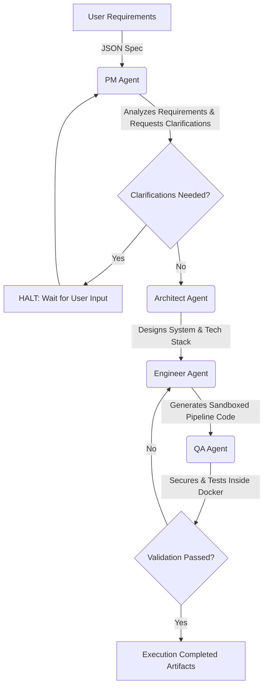

# 🧠 AI Data Engineering Platform (V1)


A production-grade multi-agent autonomous AI Data Engineering platform. This system acts as an "AI employee" capable of conversing to interpret client requirements, architecting cloud and local ELT schemas, securely generating data pipelines, and executing them inside isolated sandboxes to guarantee production-readiness.

Built with **LangChain**, **Anthropic Claude**, **PostgreSQL**, and **Docker**.

---

## ✨ Showcase Features

- 🤖 **Autonomous Multi-Agent Orchestration**: Specialized agents (PM, Architect, Engineer, QA) collaborate automatically via DAG scheduling to analyze, design, build, and test applications.
- 🛑 **Resilient State Resumption**: Complete internal state persistence via PostgreSQL allows the orchestrator to halt at clarification bounds or transient API errors, saving progress and safely resuming right where it left off.
- 🛡️ **Execution Sandboxing**: All generated Python and SQL code is validated by a Security AST module locally and securely tested inside deterministic, no-network, auto-expiring Docker containers.
- 📊 **Robust Observability**: Fully integrated OpenTelemetry hooks (Logs, Metrics, and Tracing) to track agent thoughts, execution limits, and system health metrics.

---

## 🏗️ Architecture Flow

The execution runtime relies on a Directed Acyclic Graph (DAG) state mechanism traversing four distinct AI personas.



---

## 🚀 Getting Started

### Prerequisites
- **Python 3.9+**
- **Docker Engine** (For the QA test sandbox environments)
- **PostgreSQL** (For system trajectory tracking and orchestration state)

### 1. Installation Environment

```bash
# Set up a lightweight environment
python3 -m venv .venv
source .venv/bin/activate

# Install the application and CLI
pip install -e ".[dev]"
```

### 2. Configuration Parameters

Copy the included environment template and add your credentials (e.g. Anthropic API keys).

```bash
cp .env.example .env

# Verify the .env file has LLM_MAX_TOKENS set to 8192
# Check that the PostgreSQL URI points to a valid instance
```

### 3. Initialize Infrastructures

Ensure your Postgres DB and Docker daemons are running, then initialize the database tables:

```bash
python scripts/setup_db.py
```

---

## 🛠️ Usage Mechanics

The entire orchestration layer is exposed securely via a simple runner CLI.

### Execute a Data Pipeline Project
Pass the high-level business logic requirements in JSON format. The system will ingest it, initialize internal state, and assign the PM Agent to construct the work DAG.
```bash
python scripts/run.py --input sample_project.json
```

### Dry Run / Syntax Validation
Useful for pipeline validation without incurring LLM charges.
```bash
python scripts/run.py --input sample_project.json --dry
```

### Advanced Resumption
If pipeline generation crashes due to token limits or requires user clarification, you can securely restart the pipeline with contextual injections using your `run_id`.
```bash
python scripts/run.py --resume <your-run-id>
```

*(Note: We provide a helper script at `scripts/provide_clarification.py` to seamlessly inject conversational logic back to halted orchestrators).*

---

## 📂 System Topography

```text
ai-data-eng/
├── scripts/              # Development and CLI execution endpoints
├── src/
│   ├── agents/           # Prompts and logic for PM, Architect, Engineer, QA limits
│   ├── models/           # Pydantic schema validation structures
│   ├── observability/    # OTEL tracing, metric logs
│   ├── orchestrator/     # Core DAG execution and retry logic schemas
│   ├── sandbox/          # Docker execution management mechanisms
│   └── state/            # Backend adapters (PostgreSQL persistence serialization)
└── tests/                # Robust pytest suite ensuring platform integrity
```

---

## 🔜 Roadmap (V2 Context)
The current *V1 Pipeline* successfully integrates the LLM engine constraints, deterministic pipeline orchestration scheduling, and recursive runtime bounds. Next, **V2** will implement:

1. Dynamic vector-based VectorDb Memory structures to natively query historical generated pipelines.
2. Direct Slack API webhooks to interact with the PM Agent for real-time clarification loops.
3. Complex agentic code generation streaming to overcome native LLM JSON payload boundary ceilings.
